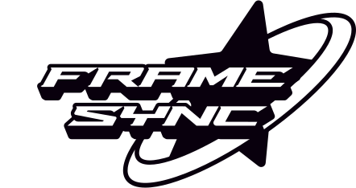

<div align="center">

  

# FrameSync

**Video review & conditional delivery for post-production studios.**

Upload a cut, send your client a secure magic link, collect frame-accurate
feedback in real time — and the high-resolution master only unlocks after
their digital sign-off.

</div>

---

## Features

- **Magic-link client access** — no client accounts or passwords. Each project
  gets a scoped review link; the link *is* the credential.
- **Kanban production pipeline** — drag-and-drop project cards across stages
  (Pre-Production → Rough Cut → In Review → Approved).
- **Frame-accurate review** — scrub the proxy video, pause on any frame, and
  sketch annotations directly on it with the drawing toolbar. Comments are
  pinned to exact timestamps and frames.
- **Real-time collaboration** — Socket.io presence indicators and live comment
  sync between the agency and the client.
- **Conditional master delivery ("Level Lock")** — the master file stays
  locked until the client approves. Approval is recorded in an immutable
  audit trail (who, when, from which IP).
- **In-browser compression** — uploads over 100 MB are transcoded entirely
  client-side with ffmpeg.wasm (x264, dynamic bitrate budget targeting a
  100 MB proxy). No server-side ffmpeg, no upload of huge originals needed
  for review.
- **Pluggable storage** — AWS S3 (or any S3-compatible store like MinIO) in
  production, or disk-backed local storage for development. Media is served
  via presigned / HMAC-signed URLs.
- **Email notifications** — review links to clients, feedback and sign-off
  alerts to the agency (SMTP via Nodemailer; optional).
- **Animated WebGL backdrop** — a Three.js "light ripple" shader behind the
  UI, with a calm cream theme available via the toggle.

## Tech stack

| Layer   | Tools |
| ------- | ----- |
| Client  | React 18, Vite, Tailwind CSS, Three.js, ffmpeg.wasm, Socket.io client, react-router, dnd-kit |
| Server  | Node.js, Express, Socket.io, Mongoose (MongoDB), JWT auth, Nodemailer, AWS SDK v3 |
| Deploy  | Docker Compose (nginx static client + Express API + MongoDB), optional MinIO |

## Project structure

```
FrameSync/
├── client/               # React + Vite frontend
│   ├── public/logo.svg   # Silver Star brand mark
│   └── src/
│       ├── components/   # VideoReviewer, kanban, modals, shader background…
│       ├── pages/        # AgencyDashboard, ProjectDetail, ClientPortal, AdminLogin
│       ├── lib/          # ffmpeg compression pipeline, constants
│       ├── hooks/        # real-time project room (Socket.io)
│       └── services/     # API + socket clients
├── server/               # Express API
│   ├── controllers/      # auth, projects, comments, approvals, uploads
│   ├── models/           # Mongoose schemas
│   ├── routes/           # REST routes (+ local media streaming)
│   ├── socket/           # Socket.io setup
│   ├── utils/            # S3 / local storage, mailer, templates
│   └── server.js         # entry point
├── docker-compose.yml    # full-stack containerized deployment
└── FrameSync_PDD.md      # full product design document
```

## Getting started (local development)

### Prerequisites

- Node.js 18+
- MongoDB — a free [Atlas](https://www.mongodb.com/atlas) cluster or a local
  `mongod`
- Two terminals (one for the API, one for the client)

### 1. Clone and configure the API

```bash
git clone https://github.com/<your-user>/framesync.git
cd framesync/server
npm install
cp .env.example .env
```

Edit `server/.env` — the minimum required values:

| Variable | Notes |
| -------- | ----- |
| `MONGO_URI` | Atlas connection string. **URL-encode special characters in the password** (`@` → `%40`). |
| `JWT_SECRET` | Any long random string. |
| `STORAGE_MODE` | `local` for dev (no AWS needed — media lands in `server/storage/`), `s3` for production. |
| `CLIENT_URL` | Frontend origin, used for CORS and magic-link URLs (default `http://localhost:5173`). |
| `AWS_*` / `S3_BUCKET_NAME` | Only when `STORAGE_MODE=s3`. |
| `SMTP_*` | Optional — leave `SMTP_HOST` blank to log emails instead of sending them. |

> **Atlas connection refused?** Check **Network Access** in the Atlas console —
> your IP must be whitelisted (or add `0.0.0.0/0`).

Start the API:

```bash
npm run dev        # nodemon — watches for changes
```

You should see `FrameSync API + Socket.io running on port 5001`.

### 2. Start the client

```bash
cd ../client
npm install
npm run dev
```

The app runs at **http://localhost:5173** (Vite proxies `/api` and the
Socket.io websocket to port 5001).

Register an agency account at `/login`, create a client and a project, upload
a proxy video, and share the review link.

### Using FrameSync from other devices on your Wi-Fi

The dev client binds to all interfaces (`host: true`), and the API derives
shareable magic-link origins automatically — so links generated on your
machine open correctly on another laptop on the same network via
`http://<your-lan-ip>:5173`.

## Docker deployment (production-style)

```bash
# from the repo root (configure server/.env first)
docker compose up --build
```

| Service | URL | Notes |
| ------- | -- | ----- |
| `web` | http://localhost:8080 | nginx: built client + same-origin API proxy |
| `api` | internal `:5001` | Express + Socket.io |
| `mongo` | internal | MongoDB 7 with a named volume |

Compose overrides `MONGO_URI` to the internal `mongo` service and sets
`CLIENT_URL` to the public web origin, so magic links work out of the box.
For S3-compatible local storage add the storage profile:

```bash
docker compose --profile storage up
# MinIO on :9000 (console :9001) — set S3_ENDPOINT=http://localhost:9000
# and S3_FORCE_PATH_STYLE=true in server/.env
```

## Scripts

| Location | Command | What it does |
| -------- | ------- | ------------ |
| `client/` | `npm run dev` | Vite dev server (LAN-accessible) |
| `client/` | `npm run build` | Production build to `client/dist` |
| `server/` | `npm run dev` | API with nodemon reload |
| `server/` | `npm start` | API (production) |

## How the review flow works

1. **Agency** signs in, creates a client + project, and uploads the review
   proxy (optionally the final master, which stays locked).
2. **Share** generates a magic link — sent by email if SMTP is configured,
   otherwise copy it manually.
3. **Client** opens the link (no login), watches the proxy, sketches on
   frames, and leaves timestamped comments. Everyone in the room sees new
   comments and presence live.
4. **Approval** — when the client signs off, the project moves to Approved
   and the master download unlocks for them. The approval event is recorded
   immutably (user, timestamp, IP) for the audit trail.

See [`FrameSync_PDD.md`](./FrameSync_PDD.md) for the full product design
document.

<div align="center">
<sub>Built with the Silver Star post-production workflow in mind.</sub>
</div>
